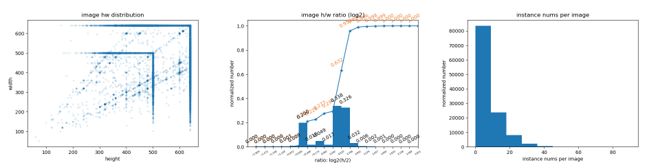
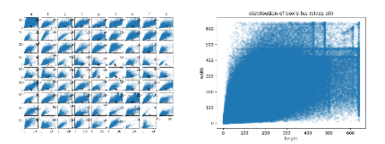
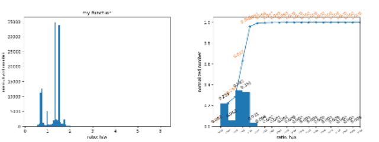
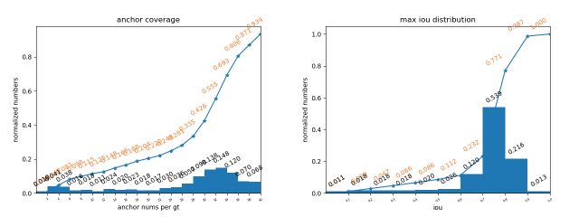

# 1. Introduction
``Volkscv.analyzer.statistics`` is designed to get the statistics of data distribution.

# 2. Support
- [x] Data statistics

- [x] Anchor statistics

- [x] Error statistics

# 3. Usage
```python
import json

import matplotlib.pyplot as plt

from volkscv.analyzer.statistics import statistic_data, statistic_anchor, statistic_fp
from volkscv.analyzer.statistics.utils import AnchorGenerator, MaxIoUAssigner
from volkscv.utils.parser import parse_data


anno_data = parse_data(
        format='coco',
        anno_path=r'instances_train2017.json',
        ignore=True,
        min_size=1,
    )
danno = statistic_data(anno_data)


def show(data):
    plt.title('my function')
    plt.hist(data, bins=100)
    """other code"""


def data_statistics_defult():
    # default statistics
    danno.default_plot()  # statistics and plot
    danno.show()  # show the plot figure
    danno.export('./default', save_mode='folder')  # export the analysis results to a folder
    danno.clear()  # clean the plot figure in workspace


def data_statistics_change_plot_func():

    danno.image.ratio.plot(show)
    danno.export('./image_ratio', save_mode='folder')
    danno.clear()


def data_statistics_get_processor():
    print(danno.processor)


def data_statistics_plot_on_one_image():
    danno.figure('combine')
    danno.image.ratio.plot(show)
    danno.image.ratio.plot(plt.hist, bins=10)
    danno.image.ratio.plot(plt.hist, bins=100)
    danno.show()
    danno.export('./combine', save_mode='folder')
    danno.clear()


def anchor_statistics():
    # 1. anchor generator
    anchor_generator = AnchorGenerator(strides=[8, 16, 32, 64, 128, 256],
                                       ratios=[0.25, 0.5, 1.0, 2.0, 4.0],
                                       octave_base_scale=4,
                                       scales_per_octave=3, )
    # 2. assigner
    assigner = MaxIoUAssigner(0.5, 0.5, ignore_iof_thr=-1)
    # 3. statistics
    aanno = statistic_anchor(anno_data, (800, 1333), anchor_generator, assigner=assigner)
    aanno.sections = [[0, 32], [32, 96], [96, 640]]
    aanno.default_plot(figsize=(15, 15), dpi=300)
    aanno.export('./anchor_default', save_mode='folder')
    print('Anchor analysis done!')


def fp_statistics():
    """Just for detection."""
    # 1. crate dummy json file
    fake_pd = [{'image_id': 1, 'bbox': [0, 0, 5, 5], 'score': 0.5, 'category_id': 1}]
    fake_gt = {'info': {}, 'licenses': [],
               'images': [{'license': 0, 'file_name': 1, 'coco_url': '',
                           'height': 500, 'width': 400, 'date_captured': '',
                           'flickr_url': '', 'id': 1}, ],
               'annotations': [{'segmentation': [], 'area': 100, 'iscrowd': 0, 'image_id': 1,
                                'bbox': [0, 0, 10, 10], 'category_id': 1, 'id': 99, 'style': 0, 'pair_id': 0, }, ],
               'categories': [{'id': 1, 'name': '1', 'supercategory': 'tt'},
                              {'id': 2, 'name': '2', 'supercategory': 'tt'},
                              {'id': 3, 'name': '3', 'supercategory': 'tt'},
                              {'id': 4, 'name': '4', 'supercategory': 'tt'}, ]
               }
    json.dump(fake_pd, open('fake_predict.json', 'a+'))
    json.dump(fake_gt, open('fake_ground_truth.json', 'a+'))
    # 2. statistics
    fa = statistic_fp('fake_predict.json', 'fake_ground_truth.json')
    fa.default_plot()
    fa.show()
    fa.export('./fp_analysis', save_mode='folder')
    fa.clear()
```


```python
data_statistics_defult()
```
Samples of statistics results of COCO.



```python
data_statistics_change_plot_func()
```
Left is the result by defined function show, right is the default result.

```python
data_statistics_plot_on_one_image()
```


```python
anchor_statistics()
```
Samples of statistics results of COCO.                              

