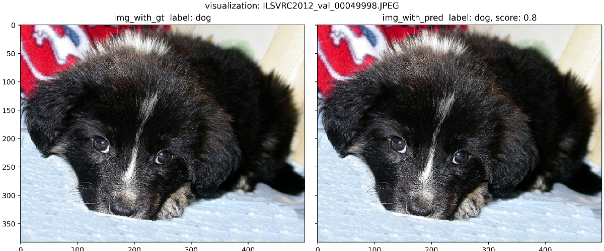
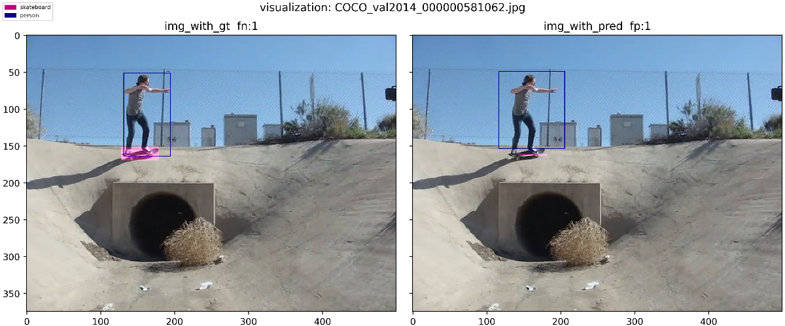
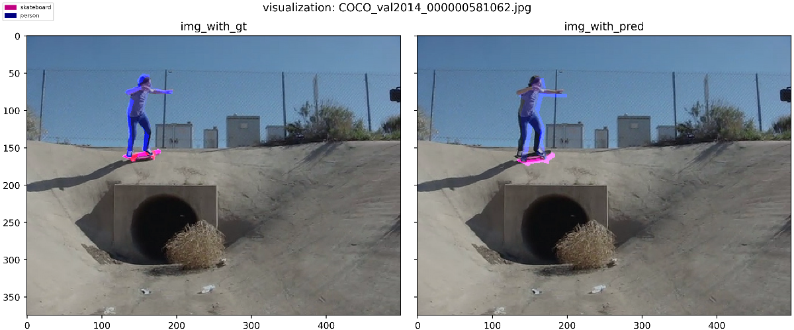

# 1. Introduction
``Volkscv.analyzer.visualization`` is designed for visualization of different cv tasks, includes classification, detection and semantic segmentation.

# 2. Support
- [x] Image browsing

- [x] Error analysis


# 3. Usage
```python
from volkscv.utils.parser import parse_data
from volkscv.analyzer.visualization import visualization


def test_cls():
    gt_anno = parse_data(format='image',
                         # txt_file='data/val.txt',
                         imgs_folder='data')
    dt_anno = parse_data(format='image',
                         # txt_file='data/val.txt',
                         imgs_folder='data')
    vis = visualization(task='cls', gt=gt_anno, pred=dt_anno)
    params = dict(save_folder='./result',
                  # specified_imgs='data/val.txt',
                  show_ori=True,
                  category_to_show=None,
                  show_score=True)
    vis.show(**params)
    # vis.save(**params)
    # vis.show_single_image(fname='190102_153233_00148901.jpg', **params)

def test_det():
    categories = ['face', ]
    gt_anno = parse_data(format='xml',
                         need_shape=False,
                         ignore=True,
                         txt_file='data/face/val.txt',
                         imgs_folder='data/face/face',
                         xmls_folder='data/face/Annotations',
                         categories=categories)
    dt_anno = parse_data(format='mmdet',
                         need_shape=False,
                         # txt_file='data/face/val.txt',
                         anno_path='data/face/face.pkl.bbox.json',
                         imgs_folder='data/face/face',
                         categories=categories)

    vis = visualization(task='det',
                        gt=gt_anno,
                        pred=dt_anno,
                        colors=dict(face=(0, 255, 0)))
    # set ignore box color, default is red
    # set matched with ignore box, default is black
    vis.colors = dict(ignore=(0, 0, 255),
                      matched_with_ignore=(0, 0, 255),
                      text=(0, 0, 255))

    params = dict(save_folder='./result',
                  # specified_imgs='data/face/face',
                  show_ori=False,
                  category_to_show=None,
                  show_score=False,
                  score_thr=0.3,
                  show_fpfn=False,
                  show_fpfn_format='mask',
                  show_ignore=True,
                  iou_thr=0.3)
    vis.show(**params)
    # vis.save(**params)
    # vis.show_single_image(fname='0_Parade_marchingband_1_20.jpg', **params)


def test_seg():
    gt_anno = parse_data(format='coco',
                         ignore=True,
                         anno_path='instances_val2014_.json',
                         imgs_folder='data/coco2014/val2014')

    dt_anno = parse_data(format='coco',
                         ignore=True,
                         anno_path='instances_val2014_pred.json',
                         imgs_folder='data/coco2014/val2014')

    vis = visualization(task='seg',
                        gt=gt_anno,
                        pred=dt_anno)

    vis.colors = dict(text=(0, 0, 255))

    params = dict(save_folder='./result',
                  category_to_show=None,
                  show_score=False,
                  show_fpfn=True)
    vis.show(**params)
    # vis.save(**params)
    # vis.show_single_image(fname='COCO_val2014_000000581062.jpg', **params)


if __name__ == '__main__':
    test_cls()
    # test_det()
    # test_seg()
```

```python
test_cls()
```
Sample of classification result of ImageNet.

```python
test_det()
```
Sample of detection result of COCO, masks indicate fn and fp bboxes.

```python
test_seg()
```
Sample of segmentation result of COCO.
